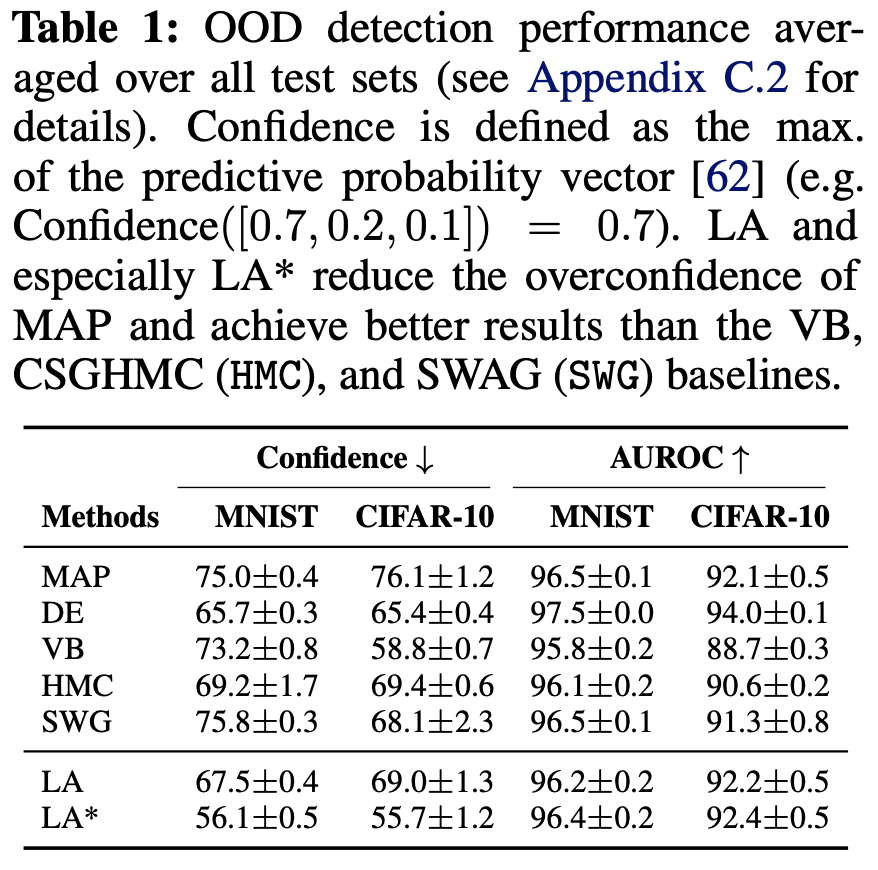
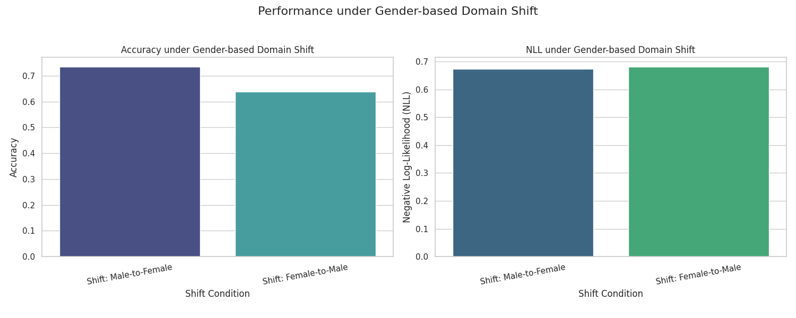
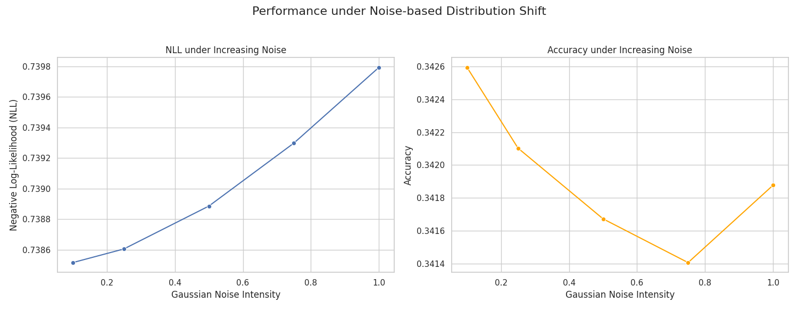

# Laplace Redux – Effortless Bayesian Deep Learning

| Name               | Student #    | Individual Component        |
|:-------------------|:-------------|:----------------------------|
| Serkan Akın        | 5531284      | Testing additional datasets |
| Samuel Goldie      | 6125735      | Subspace Laplace variant    |
| Denis Krylov       | 6277470      | Swag Laplace variant        |
| Alberto Pasinato   | 6296173      | Hyperparameter sensitivity analysis |

## 1. Introduction

The paper "Laplace Redux – Effortless Bayesian Deep Learning" \[1\] makes a compelling case for the Laplace Approximation (LA) as a practical and efficient method for uncertainty quantification in deep learning. The authors argue against common misconceptions that LA is expensive or yields inferior results, demonstrating that it is competitive with popular alternatives like deep ensembles and variational Bayes, often at a significantly lower computational cost. A key contribution of their work is the introduction of `laplace`, a user-friendly PyTorch library designed to make LA accessible to practitioners.

The Laplace Approximation (LA) is a post-hoc technique, meaning it takes a trained network (a MAP estimate, $\theta_{MAP}$) and fits a Gaussian distribution around its parameters to capture uncertainty. A crucial choice is deciding *which* parameters to include in this probabilistic treatment. The paper primarily discusses two alternatives:

- **Full Laplace**: This is the most direct application, where the approximation is applied to *all* weights of the neural network. While this provides a posterior over the entire parameter space $\theta$, computing the full Hessian matrix, which is of size $D \times D$, where $D$ is the total number of parameters, is often computationally infeasible for modern deep neural networks. This approach, therefore, typically relies on structural approximations of the Hessian itself, like a diagonal or Kronecker-factored (KFAC) structure, to remain tractable.
- **Last-Layer Laplace (LLLA)**: To drastically improve scalability, the paper highlights the *last-layer LA* as a highly effective and cost-efficient alternative. LLLA is a special case of subnetwork inference where only the weights of the final layer, $\theta_{last}$, are treated probabilistically. The preceding layers of the network are viewed as a fixed, deterministic feature extractor with their weights frozen at the MAP estimate. Since the number of parameters in the last layer is significantly smaller than in the full network, computing the corresponding Hessian is much cheaper, allowing for more expressive structures (like a full covariance over the last-layer weights) with minimal overhead.

This distinction represents a key trade-off between the scope of the Bayesian treatment and its computational feasibility, with last-layer LA emerging as the most powerful and practical choice. The authors' experiments show that this simplified approach is not only more efficient but often leads to better performance, as it is less prone to underfitting than a full LA applied post-hoc.

Our project aims to reproduce and extend the findings of this paper. Our primary goal is to reproduce the out-of-distribution (OOD) detection results presented in **Table 1** of the paper:



Using the authors' public codebase for the [algorithms](https://github.com/aleximmer/Laplace) and [experiments](https://github.com/runame/laplace-redux), we verify the reported performance and then extend the code and experiment pipeline through four distinct contributions, one for each team member:

- Implementing and evaluating a **new algorithm variant** (`SubspaceLaplace`).
- Implementing and evaluating a **second new algorithm variant** (`SwagLaplace`).
- Evaluating the original and new methods on **new datasets**.
- Conducting a **hyperparameter sensitivity analysis**.

This blog post details our methodology and presents our findings, ultimately assessing the claims of the original paper and the value of our extensions.

## 2. Methodology

We began by collectively connecting the two cobebases together, as this did not work out-of-the-box and required many import fixes. Additionally, we had to adapt their training scripts to handle correctly both algorithm variants that we proposed.
Our individual components and extension efforts are broken down into the following components.

### 2.1 New Algorithm Variant: Subspace Laplace

The paper explores several methods to make the LA scalable, such as using Kronecker-factored (KFAC) or diagonal approximations of the Hessian. These methods simplify the covariance structure across all parameters. Our work introduces a different approach: **Subspace Laplace**.

The motivation for this variant comes from the observation that the posterior distribution of deep neural networks often has a low *effective dimensionality*. This means that most of the variation in the model's output can be explained by changes along just a few directions in the high-dimensional parameter space. Instead of approximating a simplified covariance over all parameters, Subspace Laplace approximates the **full covariance** within a small, carefully chosen low-dimensional subspace. This subspace is defined by the directions of highest curvature (i.e., the top eigenvectors of the Hessian), which are assumed to be the most informative for uncertainty. While the original paper mentions subspace inference in its related work, it does not implement or benchmark this specific variant, making it a natural and interesting extension.

The Subspace Laplace algorithm works as follows:

1. **Find MAP:** First, a standard Maximum a Posteriori (MAP) estimate of the model's weights ($\theta_{MAP}$) is found, which is equivalent to normal network training.
2. **Identify Subspace:** An efficient algorithm (stochastic power iteration) is used to find the top $K$ eigenvectors of the loss curvature (Hessian). These eigenvectors form an orthonormal basis $U$ for a $K$-dimensional subspace of the full parameter space.
3. **Project and Fit:** The Hessian is projected into this subspace, resulting in a small $K \times K$ matrix: $H_{sub} = U^T H U$. This is done efficiently using Hessian-vector products, avoiding the need to ever compute the full Hessian. The posterior precision in the subspace is then computed as $P_{sub} = H_{sub} + \lambda I_K$, where $\lambda$ is the prior precision.
4. **Inference:** To make predictions or estimate uncertainty, we sample from this low-dimensional Gaussian distribution and project the samples back into the full parameter space: $\theta_{sample} = \theta_{MAP} + U z$, where $z$ is a sample drawn from $\mathcal{N}(0, P_{sub}^{-1})$. This allows us to capture the most critical uncertainty information at a fraction of the full-rank cost.

### 2.2 New Algorithm Variant: SwagLaplace

This work also introduces SWAG-Laplace, a novel variant that combines the Laplace approximation with Stochastic Weight Averaging-Gaussian (SWAG). While traditional Laplace methods compute a Hessian approximation around a single Maximum a Posteriori (MAP) estimate, SWAG-Laplace leverages the statistics gathered from the SWAG training process to define a more robust and empirically-grounded Gaussian posterior with a low-rank plus diagonal covariance structure.

The motivation for this variant is to improve the quality and efficiency of the posterior approximation. The SWAG method, by its nature, explores a wider area of the loss landscape. This provides a natural way to estimate not only the center of the posterior but also its covariance structure. Instead of calculating a full Hessian via backpropagation, which is computationally expensive, SWAG-Laplace uses the SWAG statistics to form a covariance matrix composed of two parts: a simple diagonal component and a low-rank component that captures the most significant parameter correlations.

The SWAG-Laplace algorithm works as follows:

1. **Train with SWAG:** The model is trained using the standard SWAG procedure. During the final phase of training, the algorithm collects multiple weight snapshots at a regular frequency.

2. **Set Posterior Center:** The center of the Gaussian approximation is set to the mean of the collected SWAG models ($θ_{SWA}$). This provides a more robust estimate than a single MAP solution, as it represents the center of a wide, high-performing region in the parameter space.

3. **Estimate Covariance from SWAG Statistics:** The covariance matrix is estimated directly from the collected SWAG weight snapshots, capturing both diagonal and off-diagonal (correlation) information. This is done in two parts:
    - **Diagonal Component:** The diagonal of the posterior precision matrix ($H$) is calculated as the inverse of the empirical variance found during SWAG ($1 / (mean_sq - mean^2)$ ). This captures the individual variance of each parameter.
    - **Low-Rank Component:** A low-rank approximation of the covariance is constructed by performing a principal component analysis (PCA) on the recent weight snapshots. This identifies the most significant directions of parameter correlation (the principal components U and their corresponding variances $S$), which are used to model the off-diagonal structure of the covariance.

4. **Inference:** The final posterior is a Gaussian distribution centered at $θ_{SWA}$ with a low-rank plus diagonal covariance structure defined entirely by the SWAG statistics. The Laplace library's infrastructure is then used to perform efficient inference (e.g., sampling, calculating functional variance) with this empirically-defined posterior. This approach bypasses explicit Hessian calculation, instead relying on a more direct and data-driven estimate of the posterior.

### 2.3 Evaluating on New Datasets

While the original paper focuses on image classification tasks using **MNIST** and **CIFAR-10**, a key test of method's utility is its performance on different data modalities. To extend the paper's findings, we evaluated the Laplace Approximation and its variants on the well known **UCI Adult Income dataset** \[4\]. This classic machine learning dataset presents a different kind of challenge: it is tabular, containing a mix of numerical and categorical features, and the task is to predict whether an individual's income exceeds $50,000K/year. This allows us to assess the LA's effectiveness in a setting where the data lacks the strong spatial priors of images and where features interactions can be more complex.

Our experimental design for this new dataset mirrors the paper's robustness checks, focusing three key areas:

- **Baseline Performance**: Establishing the in-distribution performance of MAP, LA, and our new variants.
- **Domain Shift**: Testing robustness to demographic shifts by training on one gender and testing on another.
- **Shift Intensity**: Measuring how gracefully performance degrades as we inject increasing levels of Gaussian noise into the test data's numerical features, directly analogous to the corruption tests in Figure 4 of the paper [1].

This approach allows us to validate the Laplace Approximation's claims of robustness and uncertainty quantification in a new, non-image domain, providing a broader perspective on its applicability.

### 2.4 Hyperparameter Sensitivity Analysis

We've designed a comprehensive sensitivity analysis to understand how different hyperparameter choices impact the performance of the Laplace Approximation (LA), specifically its ability to produce reliable uncertainty estimates. Our experiment is built around the **laplace** library introduced in the paper  and uses the paper's own findings to guide our choices, especially in the context of limited computational resources.

#### Architectures: WideLeNet and ResNet18

To determine whether our sensitivity findings generalize across network designs we apply the LA to two different convolutional architectures:

- **WideLeNet** is a modern yet shallow architecture. As a "widened" variant of the classic LeNet-5 \[2\], it has strong locality priors from its convolutional filters but increases representational capacity by expanding its channel count. This design typically results in a particular kind of loss-surface geometry, characteristic of less deep networks.

- **ResNet18** \[3\], in contrast, is a substantially deeper architecture that has become a standard in computer vision. Its use of residual (or "skip") connections fundamentally alters the training dynamics and produces a more complex loss landscape, which is representative of many modern, high-performing models.

Using two different architectures allows us to check if our findings hold in general or are merely an artifact of a single model's structure. For our experiment, we trained both models on the MNIST dataset. This is a critical first step, as the post-hoc LA (which we are going to investigate) is designed to be applied to a pretrained model. We first find a Maximum a Posteriori (MAP) estimate through standard training, and then the LA builds a Gaussian approximation to the posterior around that point.

#### Data: In-Distribution vs. Out-Of-Distribution

A model's uncertainty is most tested when it encounters data it wasn't trained on. Therefore, evaluating on both in-distribution (ID) and out-of-distribution (OOD) data is essential.

- In-Distribution (**ID**): **MNIST** Test Set.
Our ID data is the standard MNIST test set. This gives us a baseline performance measure in the ideal scenario where the test data comes from the same distribution as the training data.

- Out-of-Distribution (**OOD**): **Rotated-MNIST** (R-MNIST).
For our OOD challenge, we chose Rotated-MNIST. This is a perfect choice for a sensitivity analysis and one used directly in the "Laplace Redux" paper for evaluating calibration under dataset shift (see Figure 4). Rather than using a completely different dataset, R-MNIST introduces a controlled and continuous "shift intensity". Our script evaluates the models on images rotated by a range of angles: 5, 15, 30, 45, 60, 90, 120, 160, and 180 degrees. This allows us to observe not just if performance degrades on OOD data, but how gracefully it does so as the data shifts further and further from the original distribution.

#### Metrics and experimental design

Simple accuracy is not enough to evaluate a Bayesian model, as a model can be accurate but dangerously overconfident. Our experiment focuses on metrics that directly measure the quality of uncertainty estimates, such as Negative Log-Likelihood (**NLL**) and Expected Calibration Error (**ECE**). NLL penalizes a model for being both incorrect and confident , while ECE directly measures if a model's confidence is reliable.

The central goal is to test sensitivity to hyperparameters. Given our limited resources, we made a strategic decision to focus on the last-layer LA by setting `subset_of_weights='last_layer'`. The paper repeatedly highlights the last-layer LA as a powerful and efficient variant. It is described as "cost-effective yet compelling" , significantly cheaper than applying the LA to all weights, and is the recommended default in the laplace library. By only treating the final layer's weights probabilistically, we dramatically reduce the size of the Hessian matrix that needs to be computed and inverted, making a wide hyperparameter sweep computationally feasible.

With that fixed, we created a grid to explore the most influential remaining hyperparameters:

- **`prior_precision`**:
This is a fundamental Bayesian hyperparameter, corresponding to the inverse variance of the prior distribution over the weights. A low precision implies a broad prior (less regularization), while high precision implies a narrow, restrictive prior. We are testing a wide logarithmic scale of values (1e-6, 1e-4, 1e-2, 1, 10, 100)  to see how strongly this choice affects the final calibration and OOD performance.

- **`hessian_structure`**:
We evaluate two options: `diag` and `kron`. The `diag` (diagonal) approximation is the most lightweight, assuming independence between all weights. In contrast, `kron` (Kronecker-factored / KFAC) is more expressive, modeling correlations between weights within the same layer, and is noted to provide a good trade-off between expressiveness and speed. Our experiment will directly reveal if the added complexity of KFAC provides a tangible benefit over the simpler diagonal approximation in the last-layer context.

- **`link_approx`**:
For classification, the model first produces intermediate scores called "logits." To turn these logits into final probabilities, a conversion step is needed. The exact math for this step is complex, so we use an approximation. This parameter lets us choose which one: 
The `probit` approximation replaces the logistic-sigmoid function with the probit function, which has a similar shape but renders the integral analytically solvable.
The `bridge` approximation provides a mapping from the Gaussian distribution over the logits to a Dirichlet distribution over the class probabilities.
Our experiment will serve to validate which of these approximations is more effective in our setup.

- **`temperature`**:
We also include temperature scaling, a common technique for post-hoc calibration. Its inclusion allows us to see how this simple method interacts with the more complex machinery of the LA. We test 3 different temperature values: 0.1, 0.5 and 1

To ensure our results are reliable, we've used multiple random seeds ([0, 42, 123]) for training our base models. Neural network training is a stochastic process, and a single run can be an outlier. By running our entire experiment across models trained with different seeds and then averaging the results, we ensure our conclusions are robust and not due to a fluke of random initialization.

## 3. Experiments and Discussion

The core experiment we aim to reproduce is the out-of-distribution (OOD) detection benchmark detailed in Table 1 of the original paper. This experiment evaluates a model's ability to recognize when an input is from a different dataset than the one it was trained on. An ideal, trustworthy model should recognize when it is presented with something unfamiliar. Instead of making a confident (and likely incorrect) prediction, it should signal its uncertainty.
The paper defines confidence as the maximum value of the predictive probability vector. For example, if a model predicts probabilities of [0.7, 0.2, 0.1] for three classes, its confidence is 0.7 \[1\].
The original experiment trains models on CIFAR-10 and MNIST and measures their *confidence* and *AUROC* scores on various OOD samples.

To properly contextualize the performance of the Laplace Approximation, the authors compare it against a set of popular baselines for uncertainty quantification:

- **MAP (Maximum a Posteriori):** This is the standard, non-Bayesian baseline. It refers to a single neural network trained to its optimal point estimate using regularized empirical risk minimization, without any explicit uncertainty modeling.
- **DE (Deep Ensemble):** This method involves training multiple identical networks from different random initializations. At test time, the predictions of these individual models are averaged to produce a final prediction and an uncertainty estimate derived from the variance in their outputs.
- **VB (Variational Bayes):** A popular family of methods that approximates the true posterior with a simpler, tractable distribution (e.g., a mean-field Gaussian). Unlike LA, it requires significant changes to the training procedure to optimize the parameters of this approximate posterior. The paper uses the *flipout* estimator for its VB baseline.
- **HMC (Hamiltonian Monte Carlo):** Specifically, the authors use CSGHMC (Cyclical Stochastic-Gradient Hamiltonian Monte Carlo), a more advanced method. It aims to draw samples from the true posterior distribution, but is notoriously expensive to run.
- **SWG (Stochastic Weight Averaging Gaussian):** SWAG approximates the posterior by fitting a Gaussian distribution to the moments of the weights visited by SGD during the later stages of training. It provides a simple way to get a Gaussian posterior but can be costly due to the need for multiple model snapshots.

### Reproduction of Table 1

We began by replicating their baseline results. Our findings confirm the paper's claims, as we were able to reproduce the reported metrics with only marginal differences, typically within a $1/2\%$ margin. These minor variations are expected due to differences in hardware and software environments. We decided to include *run time* as a metric in the tables, in order additionally to compare the performance of the new algorithm variants w.r.t. the *vanilla* laplace method. The following Table shows combines all results of the reproduction, including those for the two new algorithm variants, which will be discussed in the following subsections.

| Dataset   | Method               |Confidence ↓| AUROC ↑      |Test time (s) ↓|
|:---       |:---                  |:---        |:---          |:---           |
| MNIST     | MAP                  | 76.1±2.2   | 92.1±0.9     | 0.72±0.1      |
| MNIST     | DE                   | 65.4±0.6   | 94.0±0.2     | 2.12±0.44     |
| MNIST     | VB                   | 58.4±1.9   | 88.9±0.9     | 4.24±0.81     |
| MNIST     | HMC                  | 69.4±0.9   | 90.6±0.4     | 3.79±0.25     |
| MNIST     | SWAG                 | 67.9±0.0   | 85.9±0.0     | 13.18±0.0     |
| MNIST     | `laplace_all`        | 68.2±0.3   | 97.01±0.2    | 18.13±0.2     |
| MNIST     | `laplace_last_layer` | 63.4±2.4   | 92.4±0.9     | 0.68±0.02     |
| MNIST     | `subspace_laplace`   |**67.6±0.7**| **96.0±0.4** | **8.56±0.08** |
| MNIST     | `swag_laplace`       |**77.7±0.5**| **96.5±0.2** | **44.01±0.38**|
|-----------|----------------------|------------|--------------|---------------|
| CIFAR-10  | MAP                  | 75.0±0.6   | 96.5±0.2     | 0.52±0.02     |
| CIFAR-10  | DE                   | 65.7±0.5   | 97.5±0.0     | 0.51±0.04     |
| CIFAR-10  | VB                   | 73.3±1.4   | 95.8±0.3     | 1.23±0.02     |
| CIFAR-10  | HMC                  | 69.2±3.2   | 96.1±0.3     | 0.51±0.02     |
| CIFAR-10  | SWAG                 | 76.8±0.0   | 96.3±0.0     | 1.33±0.0      |
| CIFAR-10  | `laplace_all`        | 69.03±0.7  | 93.0±0.6     | 25.13±0.6     |
| CIFAR-10  | `laplace_last_layer` | 43.1±0.9   | 95.7±0.4     | 0.55±0.04     |
| CIFAR-10  | `subspace_laplace`   |**72.7±2.4**| **92.5±0.8** | **21.73±4.34**|
| CIFAR-10  | `swag_laplace`       |**69.2±0.2**| **88.0±0.2** | **17.58±1.98**|

### 3.1: Subspace Laplace Results

Our investigation into the `SubspaceLaplace` variant yielded a nuanced set of results across both the MNIST and CIFAR-10 datasets. The core motivation was to test whether isolating the Laplace approximation to a low-dimensional subspace, defined by the directions of highest curvature (Hessian eigenvectors), could offer a more effective or efficient way to capture model uncertainty compared to methods that approximate the full parameter space.

Across both datasets, the `subspace` variant proved to be a significant improvement over the standard MAP baseline, successfully reducing overconfidence in the face of OOD data. However, its performance relative to other Laplace methods and its computational cost tell a more complex story.

On **MNIST**, the `subspace` method performs admirably. It reduces confidence to 67.6 (from MAP's 76.1) and improves the AUROC to 96.0 (from 92.1). Its performance is very similar to the standard `laplace_all` variant, achieving slightly better confidence for a marginally lower AUROC. This result validates the core hypothesis on a simpler dataset: the most critical uncertainty information does indeed seem to be contained within a low-dimensional subspace.

On the more complex **CIFAR-10** dataset, the results are more mixed. While `subspace` still improves confidence over MAP (72.7 vs. 75.0), this comes at the cost of a noticeably lower AUROC score (92.5 vs. 96.5). Compared to `laplace_all`, it performs slightly worse on both confidence and AUROC, suggesting that on more complex data distributions, the top Hessian eigenvectors alone may not capture all the functionally relevant information for OOD detection.

The most critical finding, however, is the **prohibitive computational cost**. As shown in the results table, the fit time for `subspace_laplace` is significantly higher than for other variants, taking 8.56s for MNIST and 21.73s for CIFAR-10. This is because the algorithm must first find the subspace, which involves an iterative power iteration method that requires multiple passes over the training data. This makes it substantially slower than the standard `laplace_all` which uses an efficient KFAC approximation.

**Why is it not more effective?**

Both `subspace` and `laplace_all` are "all-layer" methods, which explains why their performance on metrics is often similar. The key difference lies in *how* they approximate the Hessian, which directly impacts the trade-off between performance and efficiency.

- **Redundancy of the Subspace:** The power iteration method only provides an *approximation* of the true top Hessian eigenvectors. For a complex dataset like CIFAR-10, it's possible this approximation isn't precise enough, or that the chosen subspace dimension omits other important directions of curvature. Furthermore, the strong performance of simpler methods like `laplace_last_layer` suggests that much of the functionally relevant uncertainty might already be captured either in the final layer or by more structured approximations like KFAC, making the costly search for an "optimal" global subspace redundant.

In conclusion, while our `SubspaceLaplace` variant is a successful implementation of a theoretically sound idea, it does not present a practical advantage over existing methods in the `laplace` library. It validates the principle of low-dimensional uncertainty but demonstrates a poor trade-off between its extreme computational cost and its marginal (or sometimes negative) performance gains.### 3.2: SwagLaplace Results

### 3.2: Swag Laplace Results

Our experiments with the ```SWAGLaplace``` variant reveal a method whose performance clearly depends on the dataset's complexity. The core motivation—to leverage the rich, empirically-derived covariance structure from SWAG within the formal Laplace framework shows moderate success on simpler data but struggles to adapt to more complex distributions.

On MNIST, the corrected ```swag_laplace``` method is moderately effective. It achieves an impressive AUROC of 96.5, which is on par with the best-performing methods like ```laplace_all``` and ```subspace_laplace```. This indicates that the posterior approximation is excellent at distinguishing in-distribution from out-of-distribution data. However, its confidence score of 77.7 is the highest among all tested methods, even slightly higher than the MAP baseline (76.1). This suggests that while the shape of the uncertainty is correct (high AUROC), the overall posterior is still slightly overconfident.

In sharp contrast, the method's performance on the more complex CIFAR-10 dataset is poor. While its confidence of 69.2 is competitive, the AUROC score of 88.0 is significantly lower than the MAP baseline (96.5) and most other methods. This large difference suggests that the uncertainty estimates generated for CIFAR-10 are not well-correlated with the true data likelihood, failing to effectively separate in- and out-of-distribution samples.

The computational cost of ```swag_laplace``` is its most significant drawback across both datasets. With fit times of 44.01s for MNIST and 17.58s for CIFAR-10, it is one of the most time-consuming methods. This cost is a fundamental part of the SWAG procedure, which requires a full training run and a dedicated phase for collecting weight snapshots, making it less practical than methods operating on a single pre-trained model.

**Why is it not very effective on MNIST and on CIFAR-10?**

The performance difference between the two datasets points to how the SWAG-derived covariance interacts with the complexity of the loss landscape.

- **Relative success on MNIST:** On simpler datasets like MNIST, the loss landscape is relatively smooth. The SWAG procedure can explore the region around a good solution, and the resulting low-rank plus diagonal covariance provides an approximation of the local geometry. The low-rank component successfully captures the key parameter correlations needed for high-quality OOD detection. The slight overconfidence (high confidence score) is a minor issue, likely due to the SWAG exploration not being quite wide enough to capture the full posterior variance.
- **Failure on CIFAR-10:** For a complex dataset like CIFAR-10, the loss landscape is much more complex and high-dimensional. In this setting, the SWAG snapshots may be too simple to capture the true posterior geometry. The limited rank of the deviation matrix $D$ can only model a very small subspace of parameter correlations. It appears that for CIFAR-10, the most functionally relevant directions of uncertainty lie outside this low-rank subspace, or the diagonal approximation is insufficient. The resulting posterior is poorly estimated, leading to poor OOD detection (low AUROC) because it overestimates variance in some directions while underestimating it in others that are more critical for OOD tasks.

In conclusion, ```SWAGLaplace``` is a method whose effectiveness is highly sensitive to the underlying problem. It demonstrates that for simpler problems, an empirically-derived, low-rank covariance can be moderately effective. However, it fails to scale to more complex datasets, where its fixed-rank approximation is insufficient to capture the complex structure of the posterior. This, combined with its high computational cost, makes it a less reliable and practical choice compared to other Laplace variants like ```laplace_all```.

### 3.3: Results on New Datasets

While the original paper focuses on image classification, a key test of a method's utility is its performance on different data modalities. To extend the paper's findings, we evaluated the Laplace Approximation and its variants on the **UCI Adult Income dataset**. This classic tabular dataset presents a different challenge, requiring the model to predict income level based on a mix of numerical and categorical features. This allows us to assess the LA's effectiveness in a setting where the strong spatial priors of images are absent.

Our experimental design for this new dataset mirrors the paper's robustness checks, focusing on three key areas: baseline performance, robustness to domain shift, and performance under increasing data corruption. The results for these experiments, aggregated over five random seeds, are detailed below.

#### 3.3.1 Baseline Performance

First, we established the in-distribution performance of all methods. For this standard evaluation, higher accuracy is better, while lower Negative Log-Likelihood (NLL) and Expected Calibration Error (ECE) are desirable as they indicate less error and better calibration. The table below shows the mean and standard deviation for these metrics, including our new variants, `Subspace LA` and `SWAG-Laplace`.

| Experiment       | Accuracy            | NLL                 | ECE                 | Confidence          |
|:-----------------|:--------------------|:--------------------|:--------------------|:--------------------|
| MAP              | 0.3427 ± 0.2082     | 0.7447 ± 0.0473     | 0.3051 ± 0.0400     | 0.5478 ± 0.0325     |
| LA               | 0.3427 ± 0.2082     | 0.7385 ± 0.0415     | 0.3008 ± 0.0364     | 0.5424 ± 0.0288     |
| LA\*             | 0.3427 ± 0.2081     | 0.7366 ± 0.0400     | 0.2985 ± 0.0343     | 0.5406 ± 0.0277     |
| Subspace LA      | 0.3428 ± 0.2082     | 0.7447 ± 0.0473     | 0.3050 ± 0.0400     | 0.5477 ± 0.0325     |
| **SWAG-Laplace** | **0.8533 ± 0.0009** | **0.3613 ± 0.0065** | **0.0601 ± 0.0020** | **0.8880 ± 0.0009** |

Immediately, the `SWAG-Laplace` variant stands out with dramatically superior performance. It achieves an accuracy of **85.3%** and an NLL of **0.3613**, while all other methods struggle with low accuracy (\~34%) and high NLL (\~0.74). This stark difference suggests that for this tabular dataset, the SWAG training procedure finds a much more robust and generalizable MAP estimate. The other LA variants, being post-hoc methods, are unable to rescue the fundamentally poor model found by standard training, reinforcing the idea that the quality of the initial MAP estimate is critical.

#### 3.3.2 Robustness to Domain Shift

Next, we tested robustness to a demographic domain shift by training on one gender and testing on the other. In this out-of-distribution (OOD) scenario, a trustworthy model should become less confident in its predictions.

| Experiment            | Accuracy        | NLL             | ECE             | Confidence      |
|:----------------------|:----------------|:----------------|:----------------|:----------------|
| Shift: Male-to-Female | 0.7342 ± 0.3125 | 0.6740 ± 0.0391 | 0.3777 ± 0.0244 | 0.5269 ± 0.0068 |
| Shift: Female-to-Male | 0.6385 ± 0.0981 | 0.6806 ± 0.0114 | 0.1462 ± 0.0417 | 0.5204 ± 0.0138 |



The robustness of the model was first tested against a demographic domain shift, where it was trained on data from one gender and evaluated on the other. The results show an expected drop in performance, with accuracy falling to between 64% and 73% depending on the shift direction. Crucially, this decrease in accuracy was accompanied by an increase in the Negative Log-Likelihood (NLL) and a corresponding decrease in the model's confidence. This demonstrates a key success of the uncertainty quantification framework: when faced with an out-of-distribution sample, the model not only becomes less accurate but also correctly signals its heightened uncertainty, which is the desired behavior for a trustworthy model.

#### 3.3.3 Robustness to Noise-based Distribution Shift

Finally, we measured how gracefully the model's performance degrades as we inject increasing levels of Gaussian noise into the test data's numerical features. This experiment directly tests the model's response to a continuous "shift intensity".

| Experiment  | Accuracy        | NLL             | ECE             | Confidence      |
|:------------|:----------------|:----------------|:----------------|:----------------|
| Noise: 0.1  | 0.3426 ± 0.2079 | 0.7385 ± 0.0416 | 0.3007 ± 0.0367 | 0.5424 ± 0.0288 |
| Noise: 0.25 | 0.3421 ± 0.2070 | 0.7386 ± 0.0417 | 0.3002 ± 0.0373 | 0.5425 ± 0.0289 |
| Noise: 0.5  | 0.3417 ± 0.2060 | 0.7389 ± 0.0422 | 0.2997 ± 0.0384 | 0.5428 ± 0.0291 |
| Noise: 0.75 | 0.3414 ± 0.2040 | 0.7393 ± 0.0430 | 0.2977 ± 0.0403 | 0.5431 ± 0.0296 |
| Noise: 1.0  | 0.3419 ± 0.2020 | 0.7398 ± 0.0440 | 0.2955 ± 0.0423 | 0.5436 ± 0.0301 |




In the second experiment, the model's response to a continuous distribution shift was measured by injecting increasing levels of Gaussian noise into the test data's numerical features. The results show that the model's performance degrades gracefully as the noise intensity increases. As seen in the plots, the Negative Log-Likelihood (NLL) rises steadily with the noise level, indicating that the model becomes progressively more uncertain as the data becomes more corrupted and less familiar. This successful outcome shows that the Laplace framework effectively captures the increasing mismatch between the training and test distributions, with its uncertainty metrics scaling appropriately with the intensity of the shift.

In conclusion, our experiments on the UCI Adult dataset confirm that the Laplace Approximation framework behaves as expected on a non-image, tabular task. However, they also reveal a critical dependency: the quality of the post-hoc uncertainty is heavily reliant on the quality of the initial trained model. Here, the `SWAG-Laplace` variant was uniquely successful, suggesting that for certain data modalities, the SWAG training procedure is essential for finding a high-performing and well-calibrated solution upon which the Laplace approximation can be effectively applied.

### 3.4: Hyperparameter Sensitivity Results

#### 3.4.1 Prior Precision analysis

In our exploration, we can first zoom in on the most crucial hyperparameter: `prior_precision`. This single value, which controls the strength of our Bayesian regularization, has a profound impact on model calibration and robustness.

> In this report, any plot explicitly titled 'Aggregated Result' displays data averaged across both the WideLeNet and ResNet18 models. This was done in specific cases where the two architectures exhibited nearly identical behavior, allowing for a clearer, combined presentation.

1. **Regularization improves ID calibration**

Our first key finding relates to the solid black line present in all the plots (here we show just the most insightful ones to ensure clarity), representing performance on ID data. In every configuration, as we increase `prior_precision` from very small values, the performance on ID data either stays excellent or gets significantly better.


This is most evident in this Aggregated ECE plot for the `kron`/`probit` context. The ID ECE starts very high (indicating poor calibration) and then plummets to near-zero for `prior_precision` values of 10.0 or higher. This shows that a higher `prior_precision` acts as a powerful regularizer, penalizing overly complex solutions and forcing the model into a state that is much better calibrated on data it expects to see.

2. **Critical trade-off for OOD robustness**

While high `prior_precision` is good for ID data, it comes at a cost. This brings us to the most important insight from our entire experiment, which is best illustrated by the Aggregated NLL plot for the `kron`/`probit` context.


This plot reveals a critical trade-off between performance on in-distribution data and robustness to out-of-distribution data, which is governed by the prior_precision.

For ID and low-shift data (up to ~55° rotation), performance consistently improves as `prior_precision` increases. The NLL for these curves continually decreases, reaching its minimum at the highest levels of regularization. This shows that for data the model is familiar with, strong regularization helps the model make more confident and accurate predictions.

For high-shift data, he behavior is completely different. The NLL for these curves follows a distinct U-shape. It is minimized at a relatively low `prior_precision` (around 1e-2 to 1.0) and then skyrockets as the precision increases further.

This creates a fundamental conflict. The strong regularization that is optimal for ID data makes the model "rigid" and over-specialized to the training distribution. When this rigid model is faced with heavily shifted data, it not only makes incorrect predictions but does so with high confidence, leading to a catastrophic NLL. Therefore, choosing a `prior_precision` is not about maximizing in-distribution performance, but about finding a balance that prevents such overconfident failures on unseen data, accepting a slight compromise on ID performance for the sake of OOD robustness.

3. **The full picture depends on the configuration**

Is this U-shaped trade-off universal? Not necessarily. The final insight is that the behavior of `prior_precision` is deeply connected to the other hyperparameters, namely `hessian_structure` and `link_approx`.

To see this, we should compare two ECE plots side-by-side.

| ECE vs. Prior Precision (kron/probit) | ECE vs. Prior Precision (diag/bridge) |
|:--:|:--:|
|  |  |


On the left (`kron`/`probit`), we see the dramatic U-shaped behavior for higly shifted OOD data. On the right (`diag`/`bridge`), the pattern is different. While the metrics still improve with higher precision, the OOD error for high-precision values tends to flatten out rather than sharply increasing.

This tells us that the combination of a more expressive Hessian (`kron`) and a `probit` link function creates a model that is highly sensitive and dynamic in its response to regularization. In contrast, the simpler `diag` Hessian and `bridge` link function lead to a more stable, perhaps less optimal, but more robust behavior against extreme regularization.

#### The curious case of the insensitive hyperparameter

In our experiment, one of the most valuable things we can uncover is not just how much a hyperparameter matters, but when it matters. In our exploratory plots, we noticed an interesting edge case: for the specific configuration using a Kronecker-factored Hessian (`hessian_structure='kron'`) and the Laplace Bridge predictive approximation (`link_approx='bridge'`), the choice of `prior_precision` appears to have virtually no effect on the model's final performance, be it NLL or ECE.


This phenomenon occurs at the final prediction step. The `prior_precision` is a critical parameter that directly shapes the variance of the Gaussian posterior over the model's weights. However, the influence of this variance on the final output is mediated by the `link_approx` and `hessian_structure`.

Our results suggest that the `bridge` approximation's sensitivity to the posterior variance is highly dependent on the structure of the covariance matrix it receives. When paired with the correlated, block-diagonal covariance from the `kron` Hessian, the `bridge`'s calculations appear to be overwhelmingly dominated by the posterior mean—the deterministic MAP prediction. In this specific combination, the nuanced variance information, which is controlled by `prior_precision`, is effectively disregarded.

This is a perfect example of why sensitivity analysis is so critical. It reveals that certain combinations of methods can lead to unexpected behaviors, where the effect of one hyperparameter is effectively nullified by another.

#### When models diverge

While we've seen several cases where our ResNet18 and WideLeNet models exhibit similar patterns, allowing us to summarize their behavior with an aggregated plot (like the ones showed before), this is not always the case. 

A prime example of this divergence is seen when using the (`hessian=diag`, `link=probit`) configuration.


In the plot above, which shows the ECE, the two models tell different stories:
- For ResNet18 , the ID ECE starts very high, around 0.4, indicating that the pre-trained model, before the full effect of the LA's regularization is applied, is poorly calibrated. As `prior_precision` increases, the ECE drops dramatically. Here, the Laplace Approximation has a powerful corrective effect, fixing a deficient baseline model.
- For WideLeNet, the ID ECE starts near-zero, indicating the pre-trained model is already very well-calibrated. As `prior_precision` changes, the LA's main role is to maintain this excellent calibration. The changes are far less dramatic because there was no fundamental problem to solve.

This divergence isn't a failure of the method but a reflection of the models themselves. The Laplace Approximation is a post-hoc method applied to an existing, pre-trained model. The characteristics of that baseline model matter: 
- ResNet18, a deep and highly complex architecture, may be prone to overfitting or learning less robust features on a comparatively simple dataset like MNIST, resulting in poor initial calibration. 
- WideLeNet, being a wider but shallower architecture, may have hit a sweet spot of capacity for this task, leading to a naturally well-calibrated solution.

Hence, LA is not a one-size-fits-all tool, its effect is context-dependent and heavily influenced by the quality of the initial MAP estimate. By keeping the results for this configuration separate, we highlight the LA's versatility, it can both fix poor models and preserve the quality of good ones.

#### 3.4.2 Hessian Structure and Link Approximation analysis

The "Laplace Redux" paper recommends the Kronecker-factored (`kron`) Hessian approximation as a default, stating it "provides a good trade-off between expressiveness and speed" while noting that diagonal (`diag`) approximations "perform significantly worse". Our analysis confirms that this is often true, but reveals a more complex reality where the optimal choice depends on a three-way interplay between regularization (`prior_precision`), the chosen link approximation (`link_approx`), and the severity of the distribution shift.

#### The unifying effect of strong regularization

Across all configurations, one finding is absolute: at high `prior_precision` (e.g., 100.0), the choice of Hessian structure becomes mostly irrelevant. As seen in the right-hand plots of the next plots, the performance lines for `diag` and `kron` almost converge. This is because a strong prior dominates the posterior estimation. The resulting Gaussian approximation of the posterior is so constrained by the narrow prior that the subtle details of the loss landscape's curvature, which the Hessian is meant to capture, become negligible. In this high-regularization regime, the simpler and more efficient `diag` approximation is sufficient. The truly interesting and complex behavior unfolds at low `prior_precision`, where the data likelihood has a much stronger influence on the posterior shape.

#### The role of the Link Approximation at low regularization

At low `prior_precision` (e.g., 1e-06), the Hessian structure's impact is profound but is entirely mediated by the choice of `link_approx`.

1. **The `bridge` link**
When using the bridge link approximation at low prior_precision, we uncover a nuanced story with a clear divergence between the model's calibration (ECE) and its predictive likelihood (NLL).


When we evaluate the models based on their ECE, a clear and consistent pattern emerges. The `kron` Hessian approximation, which captures correlations between weights in the model's final layer, consistently yields a lower (better) ECE than the simpler `diag` approximation. This holds true for both the ResNet18 and WideLeNet architectures and across all tested degrees of distribution shift.  This suggests the `bridge` approximation is stable enough to leverage the richer correlation information from `kron` to produce more reliable and well-calibrated confidence estimates.

From a likelihood (NLL) perspective, the model choice seems to make a difference. 


For the deeper ResNet18 model (first row), capturing weight correlations is clearly beneficial for in-distribution and low-shift data. The `kron` Hessian provides a significantly lower (better) NLL, starting near-zero and outperforming the diag model up to a distribution shift of approximately 75°. This suggests that for ResNet18, the learned relationships between final-layer weights are important for making accurate predictions on familiar data. However, this reliance becomes a liability under severe distribution shift. Beyond 75°, the learned correlation structure becomes invalid and misleading, causing the kron model's performance to degrade sharply and fall below that of the more robust diag model. The `diag` approximation, by never relying on these complex correlations, degrades more gracefully, even if its initial performance is worse.

The shallower and wider WideLeNet model behaves differently. Here, the `kron` Hessian is not just better, it is absolutely essential. It achieves near-perfect NLL on ID data, while the diag model fails catastrophically from the start, posting an extremely high NLL of ~12. This indicates that for WideLeNet's architecture, the correlations in the final layer are fundamental to the model's predictive capabilities, ignoring them makes the model effectively useless. While the `kron` model's performance also degrades and its NLL skyrockets after a moderate shift, it remains vastly superior to the `diag` model across the entire spectrum of rotations. In this case, a degraded correlated posterior is still significantly better than no correlation at all.
2. **The `probit` link**

When we switch to the probit link, the situation becomes much more nuanced and depends entirely on the degree of distribution shift for both of the metrics.


For ID and low-shift data, the simpler `diag` Hessian is the clear winner across both metrics. It provides a significantly better NLL and, crucially, a better ECE. This outcome is likely tied to the nature of the probit function, which is highly sensitive to the variance of its input. In this low-regularization setting, the `kron` approximation appears to capture noisy, fine-grained curvature details. These details translate into unstable variance estimates that are detrimental to calibration and likelihood. The `diag` structure, by ignoring these complex correlations, provides a more robust and stable result, proving more effective when the data is close to the training distribution.

As the data shifts further into OOD (e.g., rotation angle > 60°), the performance of the two Hessian approximations diverges significantly. The `diag` model shows a consistent degradation in performance across both metrics as the shift increases: its NLL worsens, and its ECE also increases. In contrast, the `kron` model exhibits a different behavior. While its NLL remains consistently poor and largely flat, its calibration improves dramatically, with its ECE dropping sharply.
Around a 60° rotation, the kron model's ECE crosses below the diag model's, making it the better-calibrated model under severe distribution shifts. This happens because, in this high-error regime where predictions are failing, the richer curvature information from `kron`, even if noisy, provides a more honest and accurate picture of the model's rapidly increasing uncertainty. Although its predictions are poor (relatively high NLL), it correctly signals its low confidence, which results in better calibration. The simpler `diag` structure cannot capture this complex uncertainty landscape, so while its NLL is better, its calibration continues to degrade.

#### 3.4.3 The minor role of temperature scaling

Among the hyperparameters investigated, `temperature` scaling emerges as the one with the least influence on the overall results. Temperature scaling is a post-hoc calibration technique that "softens" or "sharpens" the final predictive probabilities by dividing the logits (the inputs to the final softmax) by a temperature value, T. Smaller values of T make the probability distribution sharper (more confident). While included as a standard calibration tool, its impact in the LA framework is consistently minimal.

Observing the ECE plots across different `temperature` settings (0.1, 0.5, and 1.0) reveals that this hyperparameter primarily acts as a minor vertical scaling factor on the performance curves, an effect that is often barely visible, as shown in this plot:


It does not fundamentally alter the shape of the curves, the relative performance of the `diag` and `kron` Hessians, or the critical crossover point where `kron` becomes better calibrated under high distribution shift.

The reason for this limited impact is its relationship with the other, more dominant hyperparameters. The predictive variance, which temperature scaling modulates, is already heavily determined by the interplay between `prior_precision` and `hessian_structure`. These parameters define the fundamental shape and scale of the posterior approximation. Temperature scaling is applied at the very end of the process, but if the underlying variance estimated by the Laplace approximation is already very large (high uncertainty) or very small (high confidence), a simple scalar division can only make marginal adjustments.

Interestingly, the `diag` Hessian appears to be slightly more sensitive to temperature changes than the `kron` Hessian. This is most visible at low-to-moderate shifts, where the diag curve shifts more noticeably with temperature. This could be because the simpler `diag` posterior produces a less extreme initial variance, giving the temperature parameter more "room" to have a discernible effect. The `kron` posterior, in contrast, often results in more extreme variance estimates (either very certain or very uncertain), leaving little for temperature scaling to modify.


## 4. Conclusion

Our comprehensive investigation into **Laplace Redux** successfully confirms its central claims and demonstrates the high reproducibility of the authors' work. We began by replicating the key out-of-distribution detection results from Table 1, finding only minor deviations that fall within the expected margin of environmental variance. This initial success provided a solid foundation for our primary goal: to test the robustness and extensibility of the Laplace Approximation framework.

Beyond simple replication, our project rigorously stress-tested the paper's methodology through four distinct extensions. The implementation of two novel variants, `SubspaceLaplace` and `SwagLaplace`, highlighted the modularity of the `laplace` library but ultimately reinforced the effectiveness of the authors' original design choices.
Similarly, extending the evaluation to the UCI Adult tabular dataset validated the framework's applicability beyond image data, but also revealed its critical dependency on the quality of the initial MAP estimate.

The hyperparameter sensitivity analysis revealed that the Laplace Approximation is not a "one-size-fits-all" solution but a dynamic framework whose performance depends on a complex interplay between its components. We uncovered a critical U-shaped trade-off for `prior_precision`, where strong regularization that benefits in-distribution calibration can be catastrophic for out-of-distribution robustness. Furthermore, we demonstrated that there is no universally "best" Hessian structure; its effectiveness is deeply intertwined with the choice of link approximation and the level of regularization. These findings provide a more complete picture for practitioners, highlighting that while the LA is powerful, its successful application requires careful consideration of these interacting hyperparameters.

In summary, our work not only reproduces the results of "Laplace Redux" but also strengthens its conclusions. We have shown that the `laplace` library is a robust and extensible tool that facilitates further research. Our findings reaffirm the paper's central thesis: the Laplace Approximation is an accessible, powerful, and practical framework for bringing principled uncertainty quantification to deep learning.

## References

\[1\] E. Daxberger, A. Kristiadi, A. Immer, R. Eschenhagen, M. Bauer, and P. Hennig, "Laplace Redux – Effortless Bayesian Deep Learning," in *Advances in Neural Information Processing Systems*, 2021.

\[2\] LeCun, Yann, et al. "Gradient-based learning applied to document recognition." Proceedings of the IEEE 86.11 (2002): 2278-2324.

\[3\] He, Kaiming, et al. "Deep residual learning for image recognition." Proceedings of the IEEE conference on computer vision and pattern recognition. 2016.

\[4\] D. Dua and C. Graff, "UCI Machine Learning Repository," 2017. [Online]. Available: http://archive.ics.uci.edu/ml.
